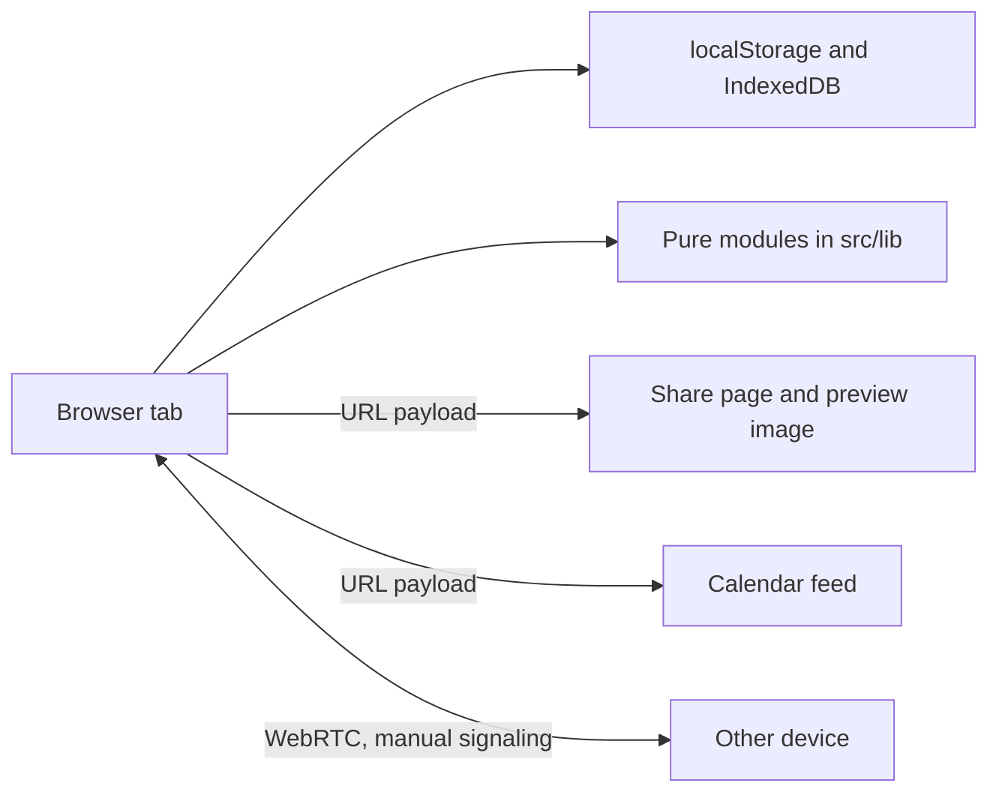

# BurnRate

BurnRate is a free, local-first subscription tracker and spending analyzer. It tracks recurring subscriptions, free trials, upcoming renewals, category spend, cancellation savings, budget goals and household cost splits, with no backend, account, database or API key. It is built with Next.js (App Router), React, TypeScript and Tailwind CSS.

**Live demo: https://burnrate-bay.vercel.app**

<!-- screenshot goes here -->

## Features

Everything in this list is wired into the UI today.

**Tracking and analysis**
- Monthly and yearly burn-rate dashboard, category breakdown and renewal timeline
- Add, edit and delete subscriptions inline; tags, saved views, bulk actions and an undo history
- Free-trial countdowns with browser notifications
- Rule-based insights, a what-if cancellation simulator, and cheaper-bundle and overlap suggestions
- Pending cancellations (schedule a cancel-on date, 7-day undo) and a running savings ledger
- Monthly burn history (24 months) with a 12-month forecast
- Usage insights, a charge-calendar heatmap and a retention-discount log
- Cancellation coach with about 20 service playbooks
- Household profiles with per-profile cost splits

**Goals and currency**
- Monthly budget cap and annual savings goals
- 22 currencies using a bundled FX snapshot (no FX API); per-currency overrides in Settings

**Adding things quickly**
- Quick-picker of 30 popular services
- Command palette (`Ctrl+K` / `Cmd+K`)
- Paste-charges importer: paste a statement or receipts and BurnRate parses the charges in the browser

**Backup, sync and sharing**
- CSV import/export, `.burn` file backup, ICS calendar export
- Sync link (`#sync=...`) that restores your full state on another device
- Public read-only share page at `/s/<payload>` with a dynamic preview image; notes are stripped
- Live calendar feed: a `webcal://` URL served from `/s/<payload>/calendar.ics`
- Device-to-device sync over WebRTC with manual copy-paste signaling and a QR code for small payloads
- Shareable summary card with PNG download

**App**
- Installable PWA that works offline once visited
- Dark and light themes, skip link, keyboard-driven palette, responsive down to 375px
- Optional passphrase screen lock (see Security and privacy)

**Partly built (library code exists, wiring is incomplete)**
- Encrypted share links: `src/lib/crypto-share.ts` and the receiving passphrase prompt (`src/components/EncryptedSharePrompt.tsx`) exist, but the Share and Data panel has no button that generates an encrypted link yet.
- Decoy passphrase: the logic is in `src/lib/decoy.ts` and a setup panel exists, but unlocking does not route to a decoy data set yet.
- Multiple vaults: the registry and manager panel exist, but stored data is not yet namespaced per vault.
- Notification settings: the panel and scheduler exist, but background (service worker) delivery is not wired.
- Annual report: a `/report/<year>` route exists, but the main UI does not link to it.

The per-version logs in `docs/progress/` are the history of this work. Some of their "deferred" notes are older than the code (the WebRTC sync UI, for example, is now wired); where they disagree, the source is authoritative.

## How it works



The app is one large client component, `BurnRateApp`, that holds state in the browser and delegates logic to pure modules in `src/lib`. Server work is stateless: the share page, its preview image and the calendar feed decode everything from the URL payload and store nothing. Sync links encode state with `lz-string`; payloads carry a version prefix (`BR1.` to `BR5.`) and older prefixes still decode. More detail is in [docs/architecture.md](docs/architecture.md).

The QR code encoder (`src/lib/qrcode.ts`, versions 1 to 10) and the WebRTC peer-sync library (`src/lib/peer-sync.ts`) are written from scratch, with no extra dependencies.

## Run it locally

```bash
npm ci
npm run dev
```

Then open http://localhost:3000. To rebuild the PWA icons after editing the source SVG: `node scripts/generate-pwa-icons.mjs`.

## Tests

```bash
npm test            # vitest
npm run typecheck
npm run build
npm run e2e         # Playwright smoke test; needs `npm run dev` running
```

There are about 530 test cases: 534 `it`/`test` calls across 50 files, counted by grep, of which 2 are in the Playwright smoke spec. They cover the `src/lib` modules, the calendar route and the main components. There is no CI configured. See [docs/testing.md](docs/testing.md).

## Security and privacy

- All data is stored in your browser (`localStorage`, plus IndexedDB for monthly snapshots). There is no server-side storage, account, telemetry or paid API.
- **The passphrase lock is a screen lock, not encryption of stored data.** It derives a key with PBKDF2 (SHA-256, 250,000 iterations) and AES-GCM 256 only to check the passphrase against a stored verifier, and then shows or hides the app. Your subscriptions remain plain JSON in `localStorage`, readable through DevTools, extensions or by anyone with access to the device. The Settings panel says so. The review behind this wording is [docs/reviews/code-and-security-review-2026-05-12.md](docs/reviews/code-and-security-review-2026-05-12.md) (finding H1). Real at-rest encryption is not implemented.
- Sync links and public share links generated from the UI are not encrypted, and anyone who has the URL can read the data. A sync link keeps its payload in the URL fragment, which browsers do not send to a server. A share link puts it in the URL path, so the server receives it in order to render the read-only page and preview image. Notes are stripped from share links.
- An AES-GCM encrypted share format (`BR5E.`, opened with a passphrase) is implemented, but the UI does not produce such links yet.
- The app serves a Content-Security-Policy and other security headers (`next.config.mjs`).

To report a vulnerability, see [SECURITY.md](SECURITY.md).

## License

MIT. See [LICENSE](LICENSE).
